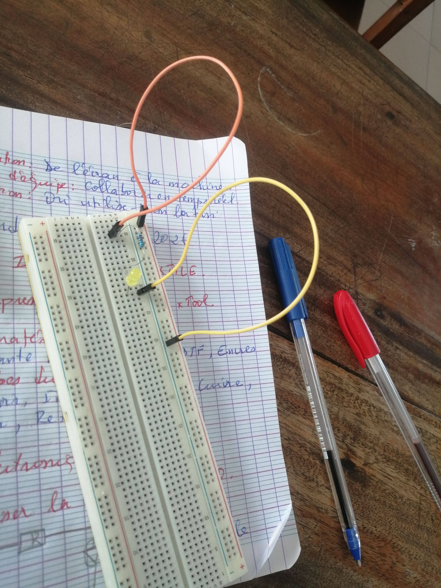
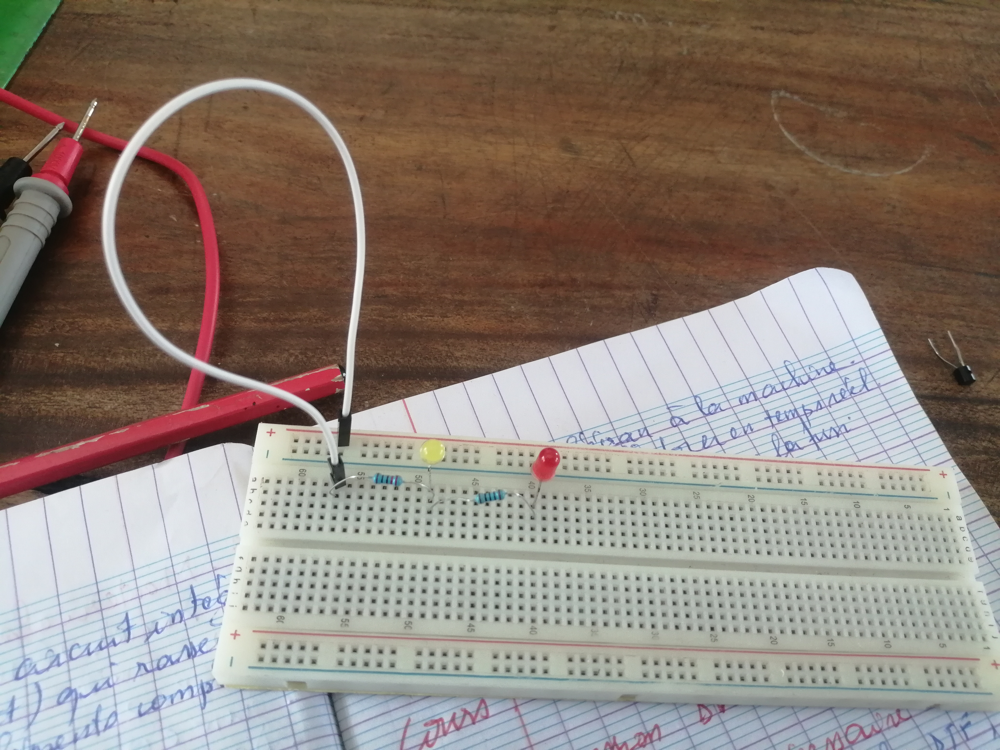
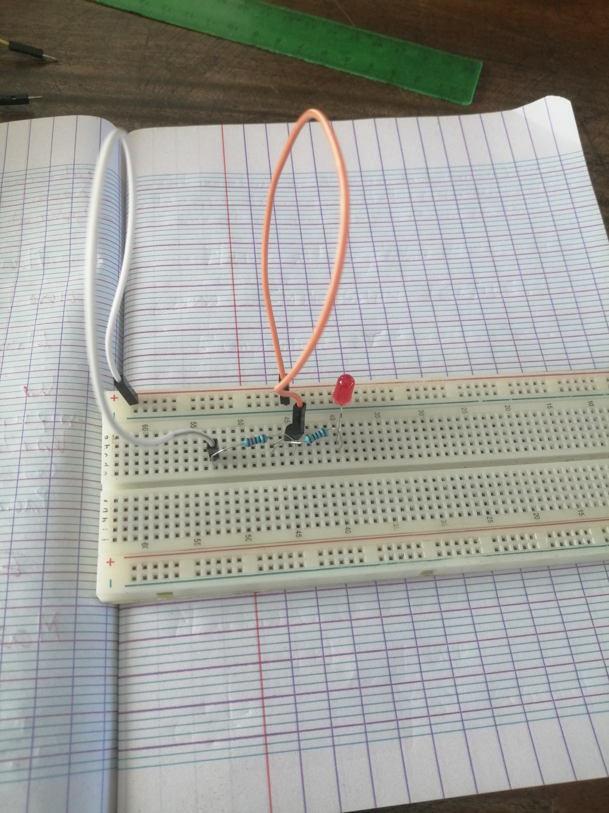

# Journal du mardi 01 Septembre 2026 (Rédigé par AGBETIASSI Amavi Emile)
## Fait aujourd'hui
# 1. IMPRESSION TEXTILE
- L'imprqession DTF avec xTool
- Le matériel nécessaire
**Imprimaante DTF xTool**, **Film DTF**, **Encres**
- Les étapes du DTF
**Concevoir**, **Imprimer**, **Poudrer**, **Cuire**, **Presser**, **Retirer le film**
- La pratique sur l"impression DTF avec xTool
# 2. ELECTRONIQUE
- Maïtriser la breadboard SK10
- Réalisation des cicuits électriques sur la breadboard SK10
- Images
> Un circuit réalisé avec une résistance et une LED

> Un circuit réalisé avec deux résistances et deux LED

> Un circuit réalisé avec duex résistances, un transistor NPN (BC337) et une LED

# 3. Conception avec le logiciel Fusion 360
- Conception des objets

## Appris
- La pratique sur l"impression DTF avec xTool
- Réalisation des cicuits électriques sur la breadboard SK10
- Conception des objets en 3D

## Raté, puis corrigé
- Raté le quatrième circuit réalisé

## Décidé
- De bien réussir le circuit et la conception 3D

## A faire demain