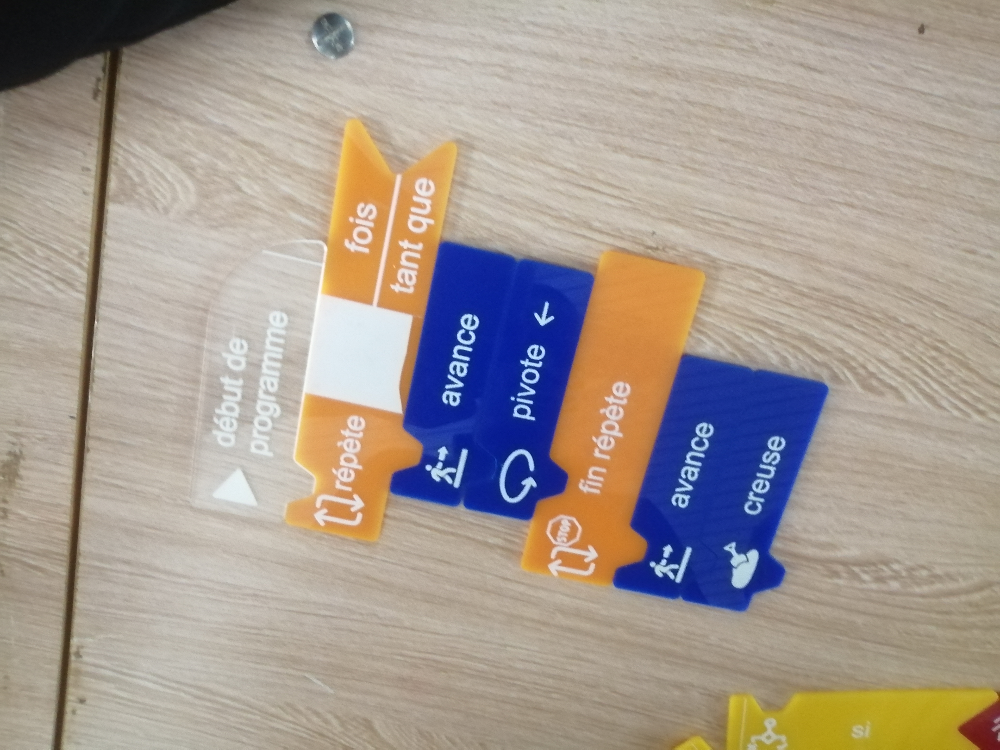
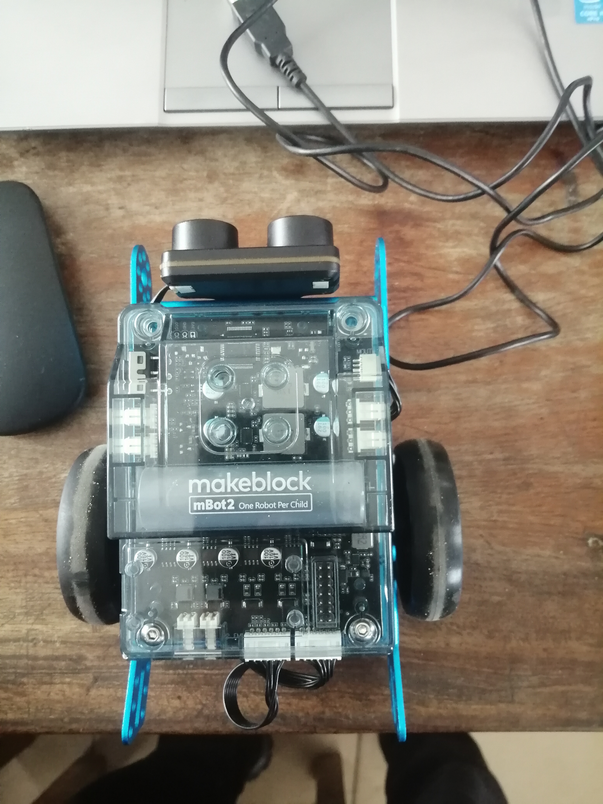

# Journal du Mercredi 02 Septembre 2026 (Rédigé par AGBETIASSI Amavi Emile)
## Fait aujourd'hui
# 1. ALGORITHIME
- Algorithme
- Algorithmique débranché
- Les trois critères de l'algorthme
- Application de l'agorithmique branché 
# 2. ELECTRONIQUE
- Visualiser une vidéo sur le montage d'un robot voitoire
- Montage du robot après visualisation
- Démontage du robot
# 3. PROJET
- Penser à la réalisation zéro du projet
- Faire un plan de réalisation

## Appris
- Programmation d'un robot en algorithme débranché pour aller creuser un trésoir
 Image

- Montage du robot électronique après visualisation
- Image

## Raté, puis corrigé

## Décidé

## A faire demain