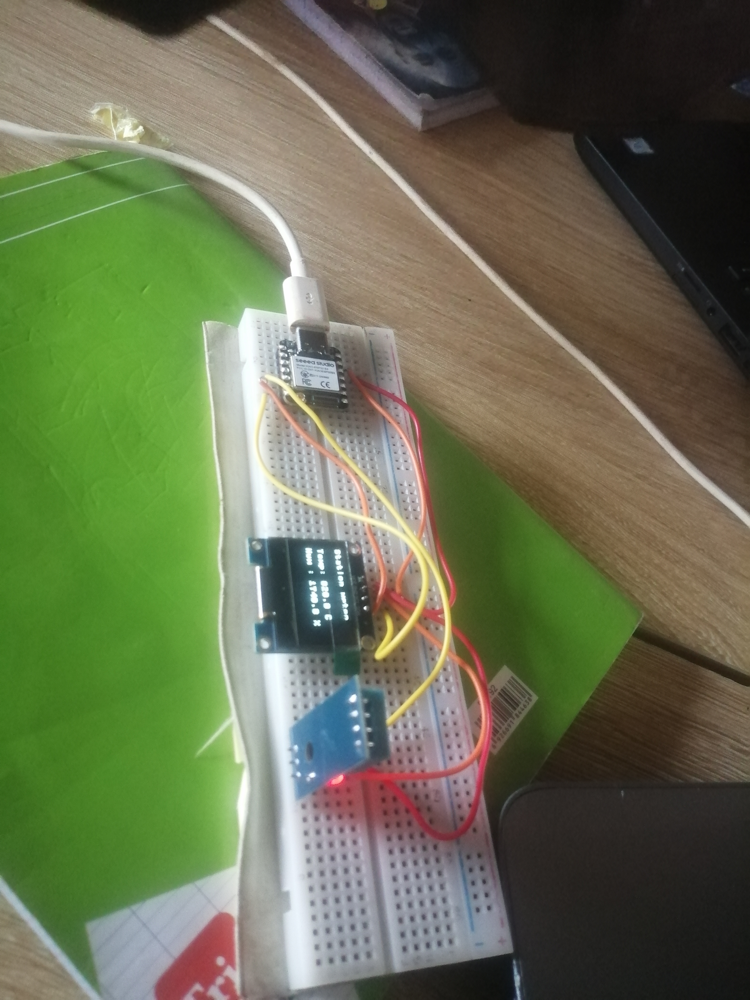
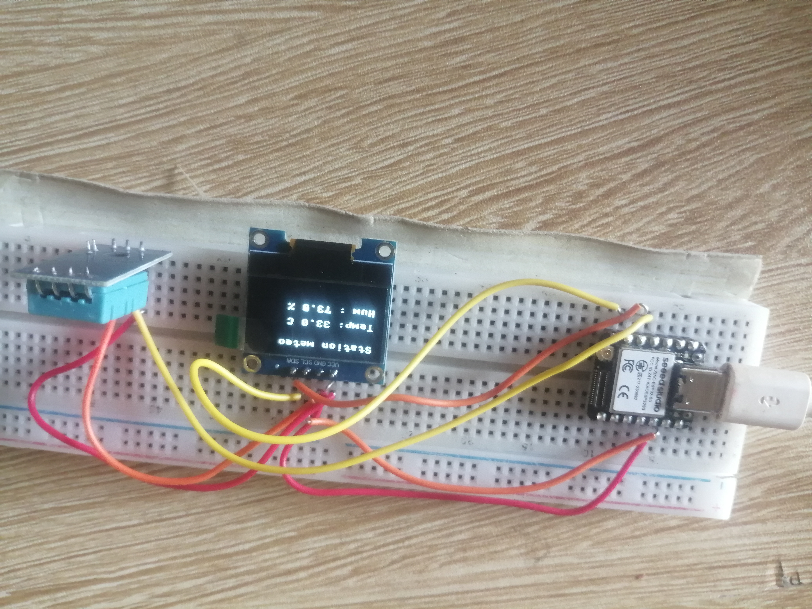

# Journal du Samedi 05 Septembre 2026 (Rédigé par AGBETIASSI Amavi Emile)
## Fait aujourd'hui
- Smart-Weather-Station
- installer et configurer l'IDE thonny pour programmer une carte ESP32 en MicroPython
- Flasher le firmware MicroPython sur XIAO ESP32S3
- Câbler correctement un capteur DHT22 et un écran OLED SSD1306 en I2C
- Installer une bibliothèque externe MicroPython via le gestionnaire de paquets de Thonny
- Lire une mesure de température et d'humudité et afficher en temps réel sur l'écran OLED
- Parler du matériel nécessaire
- Comparaison des cartes

## Appris
- Comparaison des cartes
- Comment relier les différentes bornes du matériel
- Câbler un capteur DHT22, un écran OLED et une carte ESP32S3

- Installer sur Thonny le MicroPython
- Programmer la carte ESP32S3
- Lire au temps réel la température afficher sur l'écran OLED après la programmation

## Raté, puis corrigé

## Décidé
- Ecrire moi même un programme sur une carte ESP32S3
- Bien câbler le matériel 

## A faire Lundi 07 Septembre 2026