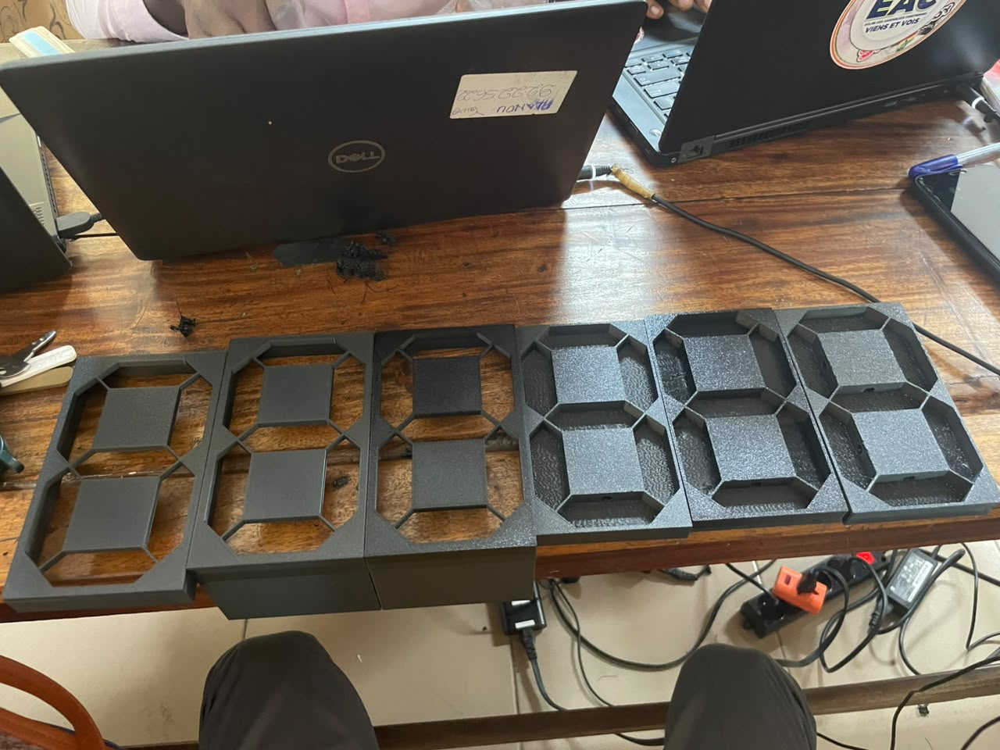

# Journal du Jeudi 10 Septembre 2026 (Rédigé par AGBETIASSI Amavi Emile)
## Fait aujourd'hui
- Conception des modèles des afficheurs 7 segments pour afficher le score
- Impression des conceptions

- Récupérer les matériels
- Conception d'un boitier pour couvrir la LED

## Appris

## Raté, puis corrigé

## Décidé

## A faire demain

- Signé: (AGBETIASSI Amavi Emile)