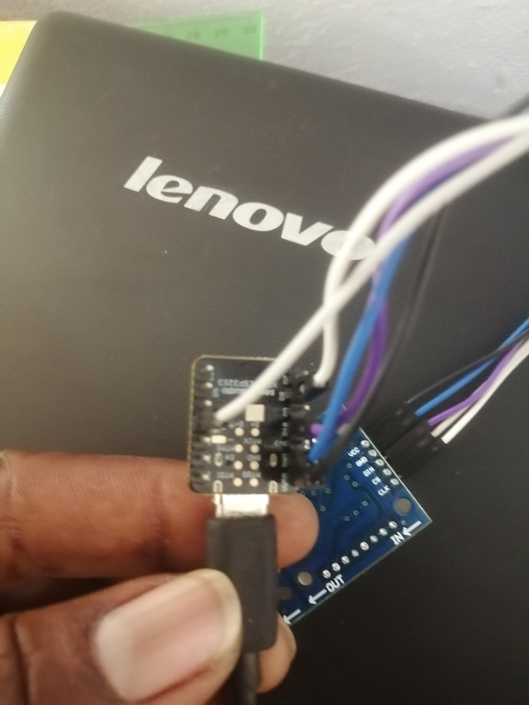
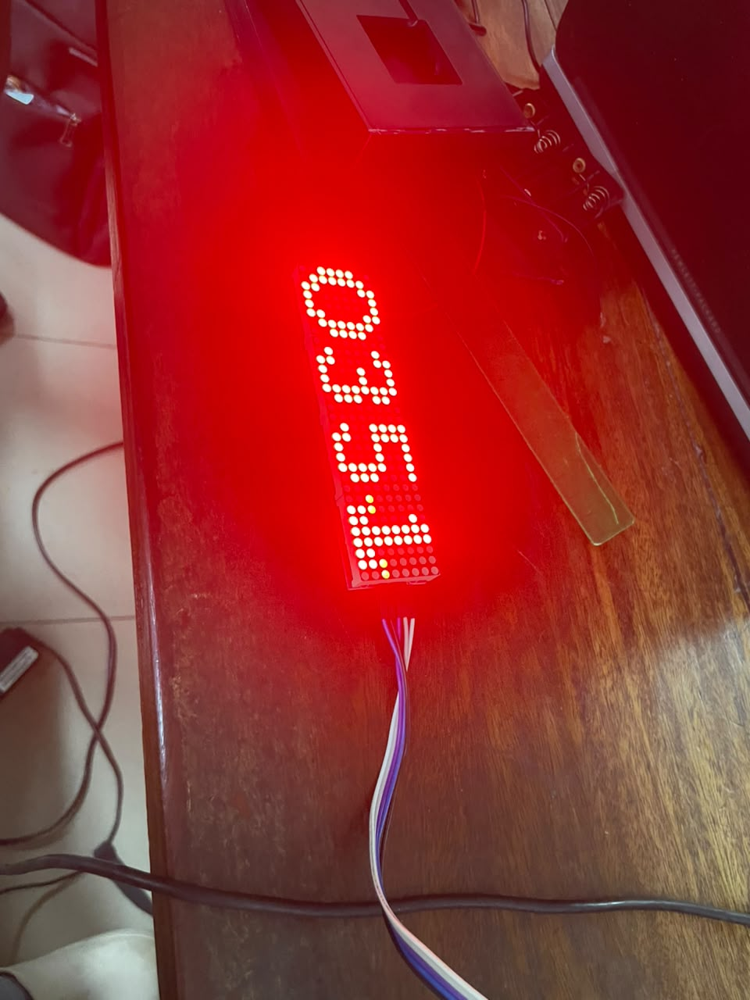

# Journal du Vendredi 11 Septembre 2026 (Rédigé par AGBETIASSI Amavi Emile)
## Fait aujourd'hui
- Les idées sur notre projet: Tableau de score
- Conception du boitier de notre projet
- Câblage entre Matrice LED et ESP32-XIAO

- Recherche d'un code pour afficher l'heure sur la matrice LED

## Appris
- Comment connester les broches d'une matrice LED et celles de ESP32-XIAo
- Comment exécuter un code dans MicroPython
- Cmment envoyuer un code sur ESP32-XIAo

## Raté, puis corrigé
- Le code n'a pas fonctionné du premier cout
- On a réussi à afficher l'heure sur la matrice

## Décidé
- De faire mieux qu'avant

## A faire demains