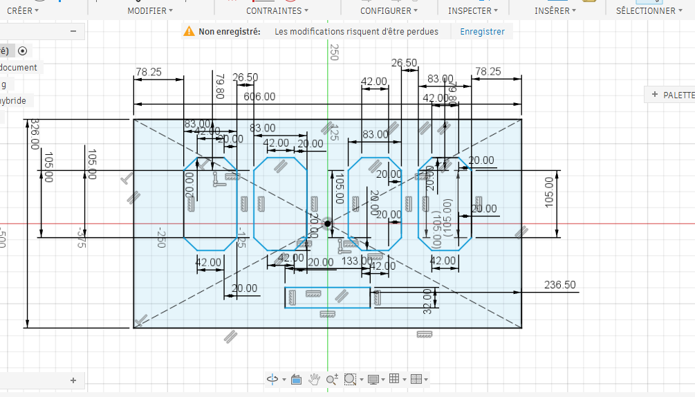
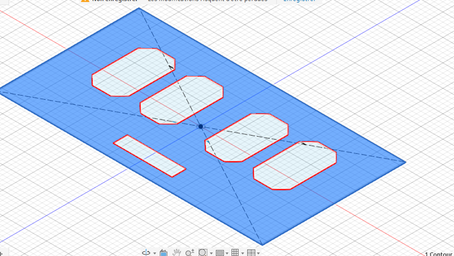
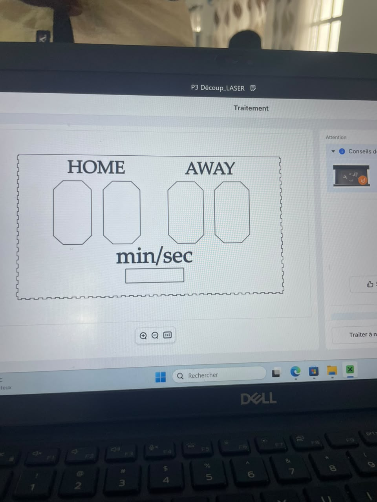
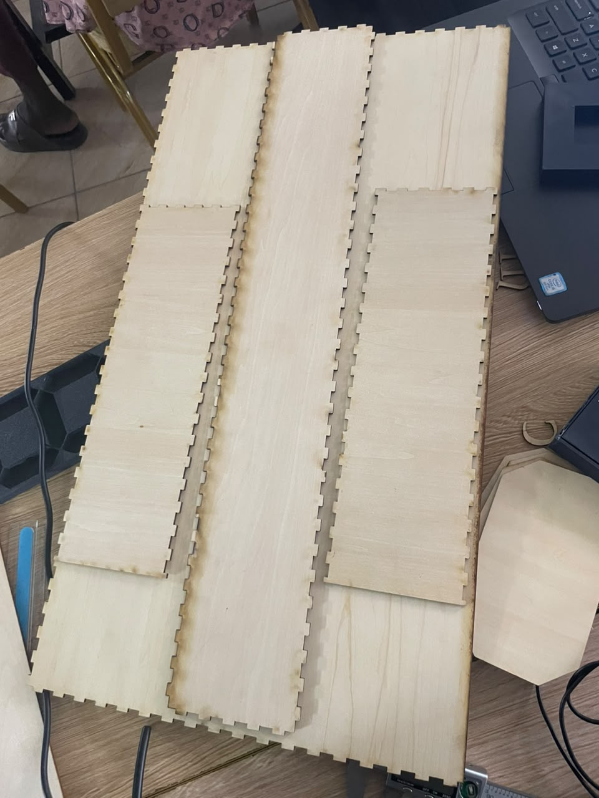

# Journal du Lundi 14 Septembre 2026 (Rédigé par AGBETIASSI Amavi Emile)
## Fait aujourd'hui
- Conception du boitier pour notre projet dans logiciel Fusion 360

- Modèlisation du boitier dans logiciel xTool

- Découpage du boitier dans decoupeuse laser

- Collage des 7 segments 

- Conception d'une boite pour ma matrice LED

## Appris
- Concevoir le boitier dans fusion 360
- modéliser le boitier dasn xTool

## Raté, puis corrigé
- Découpage du boitier pour le premier essaie

- Réussier le deuxième essaie 

## Décidé
 Terminer le projet demain

 ## A faire demain
 - Souder les LED 

