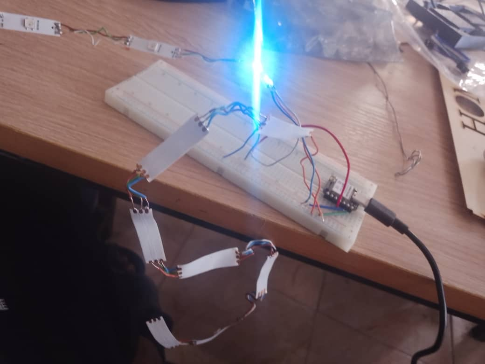
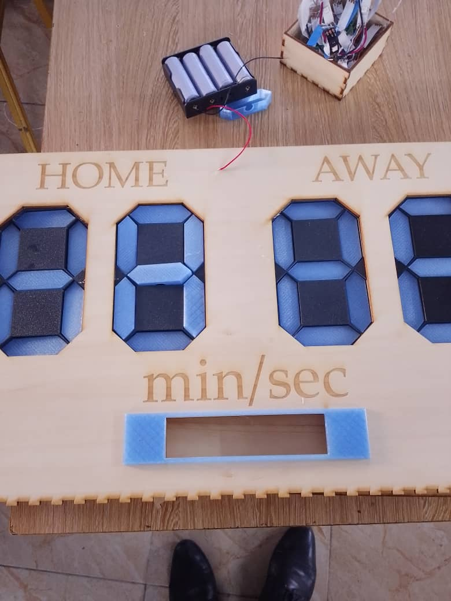

# Journal du Mardi 15 Septembre 2026 (Rédigé par: AGBETIASSI Amavi Emile)
## Fait aujourdui
- Conceptuion des petites boites pour couvrir les Leds
- Réception du ruban Led
- Couper et souder ces Leds

- Test des Leds soudées

- Montage du boitier

## Appris
- Souder les Leds 

## Raté, puis corrigé
- La soudure n'est pas bien faite
- C'est une seule Led qui sallume

## Décidé
- Décider de ne plus utilier le ruban Led
- Demander les matices à Leds
- Reception de ces matrices

## A faire demain
- Alimenteer ces matrices avec ESP32S3-XIAO
 