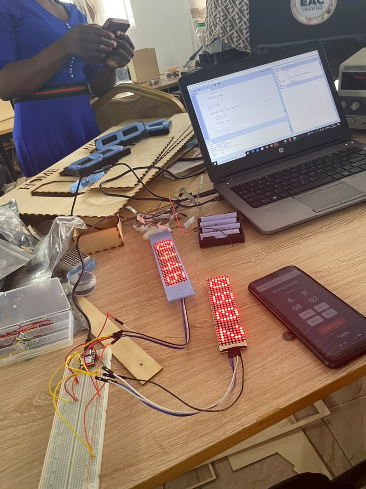
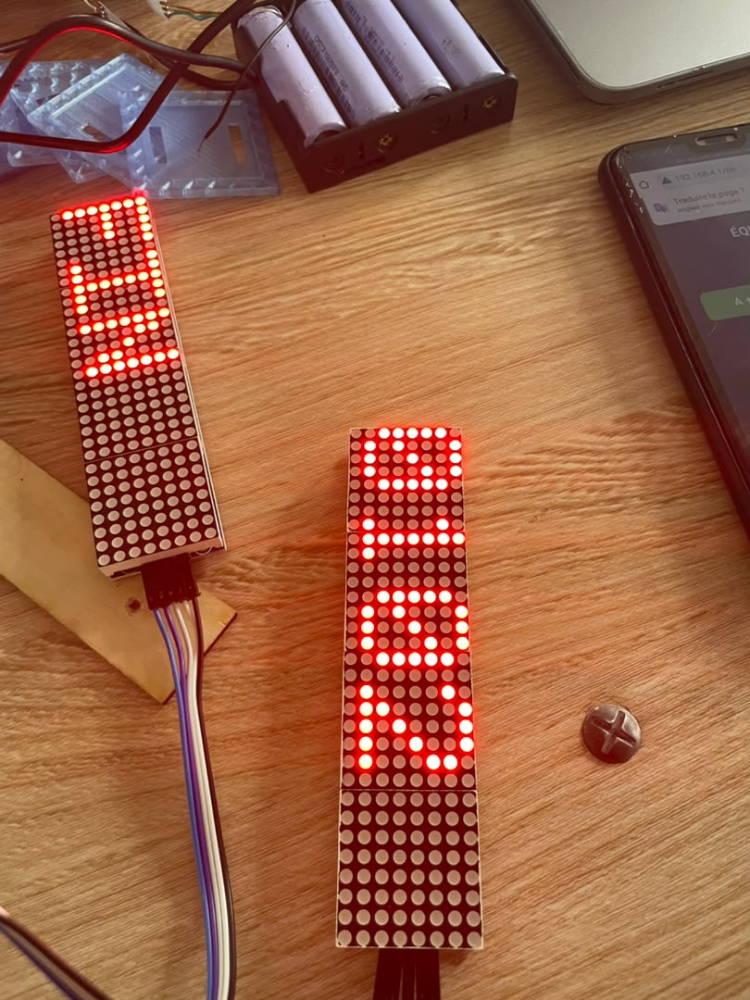
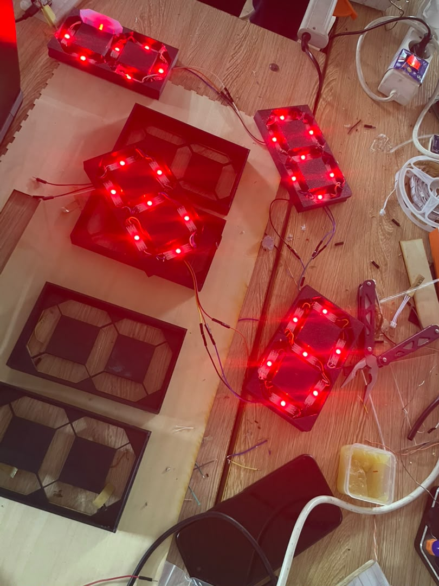
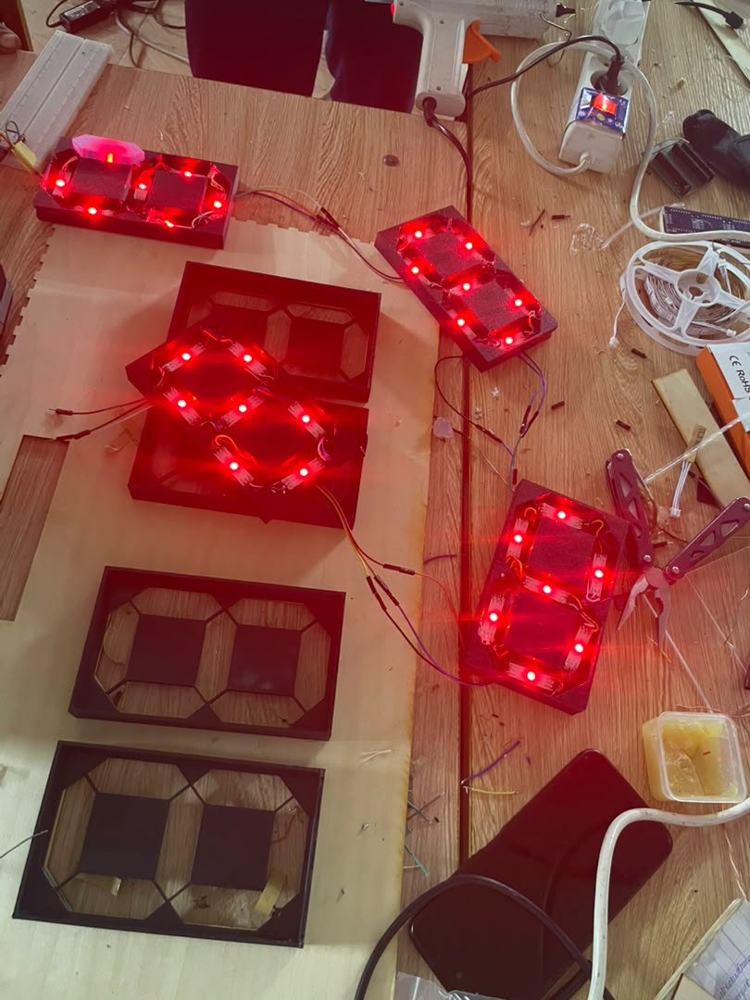

# Journal du Mercredi 16 Septembre 2026 (Rédigé par AGBETIASSI Amavi Emile)
## Faire aujourd'hui
- Alimentation dd deux matrices Led pour afficher les scores pour les deux équipes et le temps

- Conception du botier dand Fusion pour monter les matrices Led

- Changement de l'option
- Soder les petites Leds

- Changement d'option en remplaçant les petites Leds par les Leds adressables
- Souder les Leds
- Monter les Leds dans les 7 segments

- Test des Leds

## Appris
- Monter les deux matrices Leds à ESP32
- Afficher les scores et le temps sur les matrices
- Souder les petites leds et les rubans Leds
 
 ## Raté, puis corrigé
 - Les deux matrices sont grillées
 - Rater la soudure des petites leds
 - Réussir la soudure des Leds en ruban
 - Réussir à alimenter les Leds en ruban

 ## Décidé
 - De changer les petites Leds par les Leds ruban
 - Utiliser une batterie fournissant 5V pour alimenter les Leds enruban
 - Remplacer les matrices grillées

 ## A faire demain
 - Alimenter les Leds en ruban à ESP32 pour afficher les scoresdes deux équipes
 - Alimenter une matrice pour afiicher le temps
