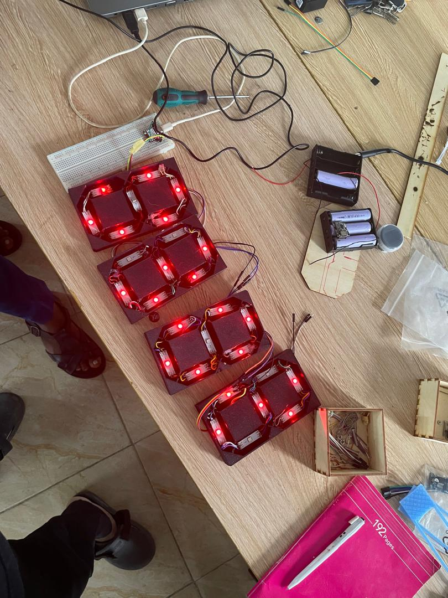
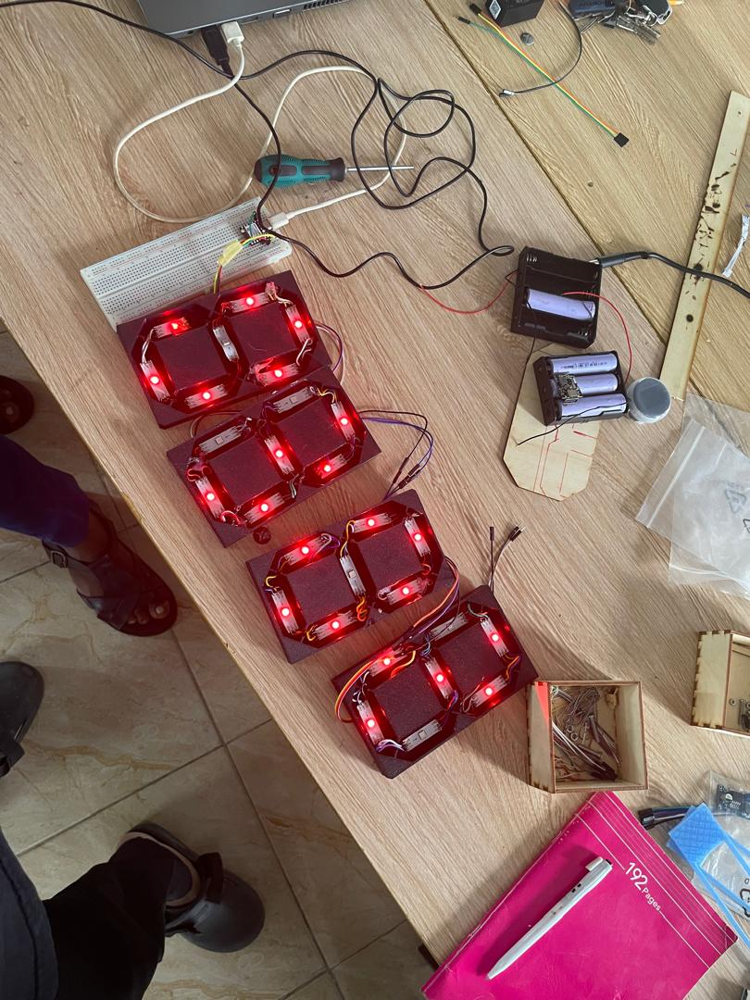
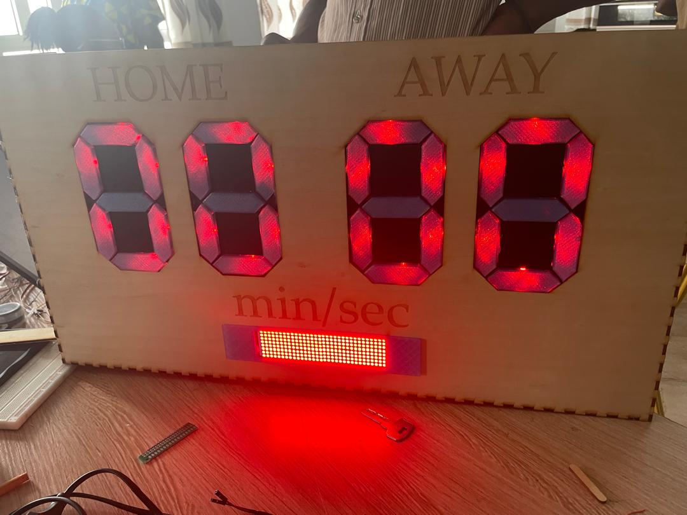
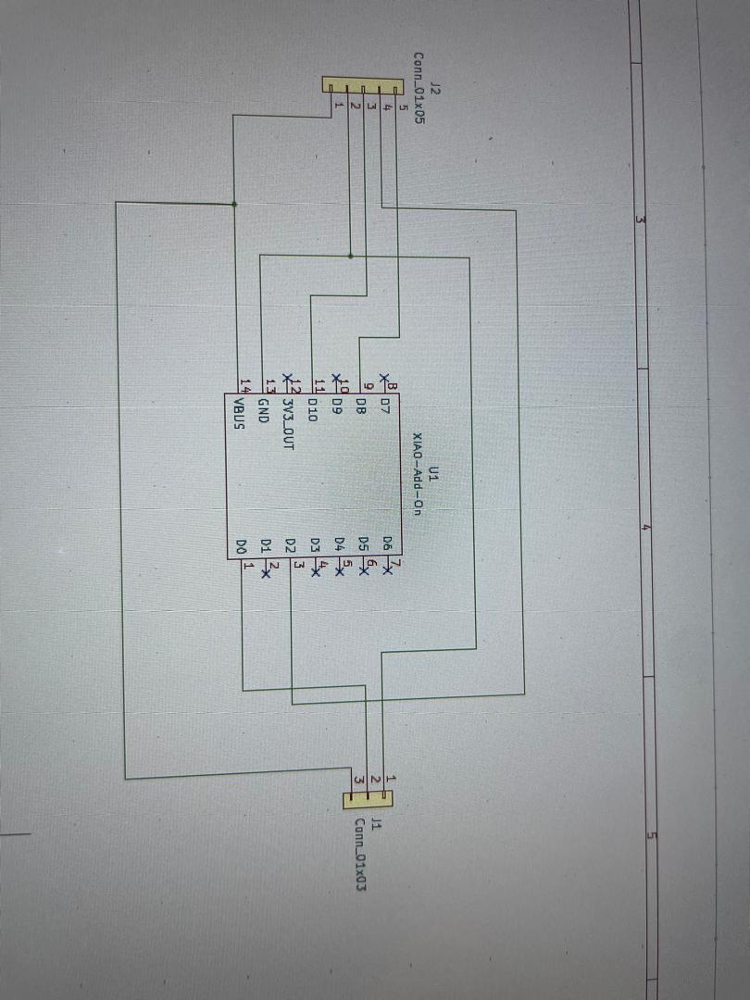
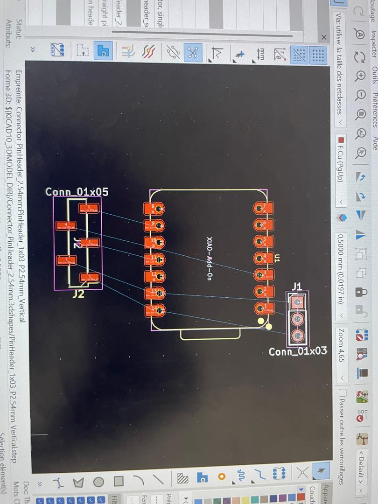

# Jounarl du Jeudi 17 Septembre 2026 (Rédigé par AGBETIASSI Amavi Emile)
## Fait aujourd'hui
- Câble entre Leds en ruban soudées et ESP32
- Identification des lettres de chaque segment sur l'afficheur
- Test des Leds avec une batterie

- L'ensemble câbler avec la matrice
- Transverser un code sur ESP32 pour afficher les scores et le temps
- Test du code

[image](../medias/image6.jpg)
- Montage des Leds dans les afficheurs 7 segments
- Réalisation du PCB 

- Montage de la boite d'alimentation

## Appris
- Identifier les lettres de chaque segment
- Monter les led dans les afficheurs
- alimenter une matrice avec ESP32 et avec des leds soudées

## Raté, puis corrigé
- Rater le code pour afficher le temps
- Dans l'affichage du temps, il y a effet miroir
- Le temps s'affiche en l'anvère

## Décidé
- Décider de corriger le code

## A faire demain
- Soutenace
- Chque groupe passera exposé son projet
